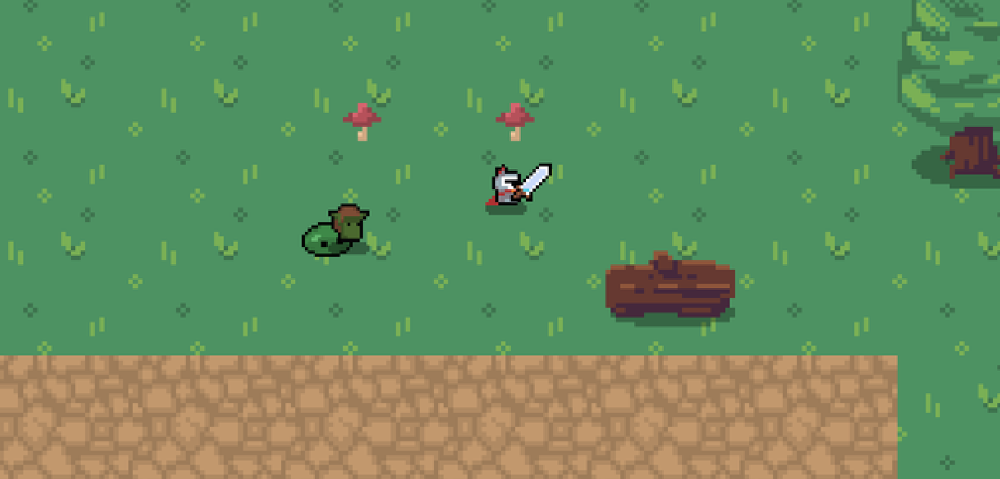

# 2D RPG Game

This is a 2D RPG game built from scratch using **C++**. The game immerses players in a pixel-art world where they can explore, battle enemies, and complete quests. With a focus on performance and modular code design, the game was developed using object-oriented principles and an event-driven architecture.

---

<table>
  <tr>
    <td>
      
    </td>
    <td>
      <b>Gameplay Screenshot:</b>
      

        This screenshot showcases the game's main features, including the pixel-art environment, player character, and enemy sprites. The game loop handles input processing, physics, and rendering efficiently, providing a smooth gameplay experience. The modular codebase enables scalability, allowing for the addition of new characters, items, and mechanics.
      

    </td>
  </tr>
</table>

